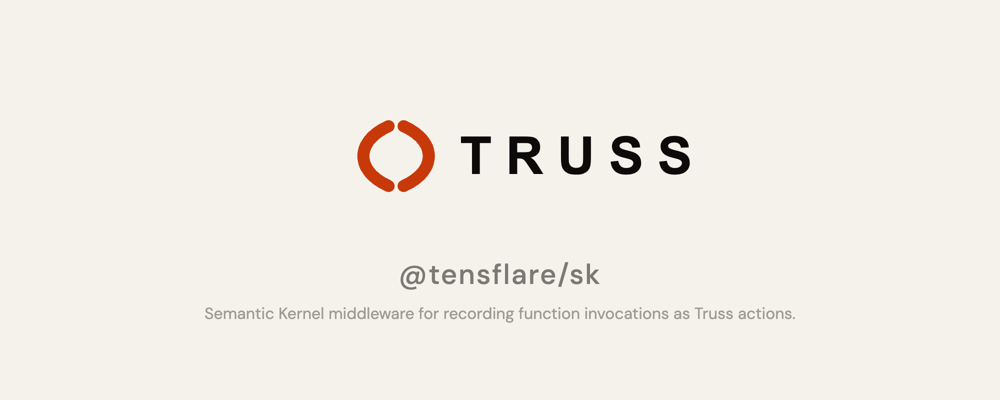

# @tensflare/sk

**Semantic Kernel middleware — wraps function invocations to record them as Truss actions.**

[](https://www.npmjs.com/package/@tensflare/sk)
[](LICENSE)
[](https://github.com/tensflare/truss-sk/actions)

---

## What is Truss?

Truss is an **accountability layer for AI agents** — it records every agent action as a cryptographically signed, tamper-evident audit trail. [Learn more →](https://truss.tensflare.com/docs)

## Overview

Wrap any Semantic Kernel function to automatically capture its arguments and return value, compute SHA-256 hashes, and POST a `sk_invoke` action record to the Truss API. Supports both sync and async functions. **Fail-open** — the function executes normally even if recording fails.

## Installation

```bash
npm install @tensflare/sk
```

## Quick start

```typescript
import { TrussSemanticKernelMiddleware } from "@tensflare/sk";

const truss = new TrussSemanticKernelMiddleware({
  apiUrl: "http://localhost:4000",
  apiKey: "tr_your_api_key",
  mandateId: "mnd_001",
});

// Wrap any Semantic Kernel function
const wrappedFn = truss.wrapFunction(myKernelFunction, "myFunctionName");
```

## API

### `new TrussSemanticKernelMiddleware(options)`

| Option | Type | Description |
|---|---|---|
| `apiUrl` | `string` | Truss API base URL |
| `apiKey` | `string` | Truss API key |
| `mandateId` | `string` | Mandate ID |

### `middleware.wrapFunction(fn, name?)`

Wraps an async function `(input: unknown) => Promise<unknown>`. Records action type `sk_invoke` with the function name and SHA-256 hashed input/output.

## Related packages

| Package | Description |
|---|---|
| [@tensflare/llamaindex](https://github.com/tensflare/truss-llamaindex) | LlamaIndex middleware (same pattern) |
| [@tensflare/openai](https://github.com/tensflare/truss-openai) | OpenAI Agents SDK middleware (same pattern) |
| [@tensflare/truss-sdk](https://github.com/tensflare/truss-sdk-js) | TypeScript SDK |
| [@tensflare/tap](https://github.com/tensflare/truss-tap) | Core Zod schemas |

## Development

```bash
npm install
npm run build
npm test
```

## Contributing

Pull requests are welcome. Please see the [contribution guidelines](https://truss.tensflare.com/docs/contributing).

## License

Apache 2.0 — see [LICENSE](LICENSE).
